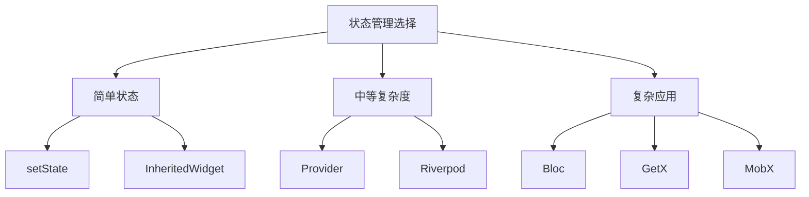

# Flutter Widget 完全指南：从入门到精通的100+组件详解

> Flutter 作为 Google 推出的跨平台 UI 框架，其核心优势在于丰富且强大的 Widget 系统。本文将全面介绍 Flutter 中 100+ 常用 Widget 和第三方知名组件，帮助你快速掌握 Flutter 开发。

## 一、Flutter Widget 概述

Flutter 采用"万物皆 Widget"的设计理念，所有的 UI 元素、布局、甚至整个应用本身都是 Widget。理解 Widget 的分类和使用场景，是 Flutter 开发的基础。

### 1.1 Widget 的核心概念

Widget 是 Flutter 中构建 UI 的基本单元，它描述了 UI 应该是什么样子的，而不是如何构建。Flutter 框架会根据 Widget 的描述来实际渲染界面。

Widget 具有以下特点：

- **声明式**：通过描述状态来构建 UI，状态变化时自动重建
- **不可变**：Widget 本身是不可变的，通过创建新的 Widget 来更新 UI
- **组合性强**：通过组合简单的 Widget 构建复杂的界面

### 1.2 Widget 分类体系

Flutter 的 Widget 可以按功能分为以下几个大类：

```mermaid
graph TD
    A[Flutter Widget] --> B[基础组件]
    A --> C[布局组件]
    A --> D[Material 组件]
    A --> E[输入组件]
    A --> F[导航组件]
    A --> G[动画组件]
    A --> H[第三方组件]

    B --> B1[Container]
    B --> B2[Text]
    B --> B3[Icon]
    B --> B4[Image]

    C --> C1[Row]
    C --> C2[Column]
    C --> C3[Stack]
    C --> C4[ListView]

    D --> D1[Scaffold]
    D --> D2[AppBar]
    D --> D3[Card]
    D --> D4[Button]

    E --> E1[TextField]
    E --> E2[Checkbox]
    E --> E3[Switch]
    E --> E4[Form]

    F --> F1[TabBar]
    F --> F2[BottomNavigationBar]
    F --> F3[Navigator]

    G --> G1[AnimatedContainer]
    G --> G2[Hero]
    G --> G3[AnimatedOpacity]

    H --> H1[CachedNetworkImage]
    H --> H2[SvgPicture]
    H --> H3[Shimmer]
```



## 二、基础组件详解

基础组件是构建 Flutter 应用的原子单位，也是最常用的 Widget。

### 2.1 Container - 万能容器

Container 是 Flutter 中最常用的布局组件之一，它提供了一个便捷的 API 来组合各种约束和装饰。

**核心属性：**

- `alignment`：子组件的对齐方式
- `padding`：内边距
- `margin`：外边距
- `decoration`：背景装饰（圆角、渐变、阴影等）
- `width`/`height`：固定尺寸
- `constraints`：额外的约束条件

**使用场景：**
- 需要添加边距、内边距的组件
- 需要背景色、圆角、边框的组件
- 需要固定宽高的组件
- 需要对齐子组件的场景

**代码示例：**

```dart
Container(
  width: 200,
  height: 100,
  margin: EdgeInsets.all(16),
  padding: EdgeInsets.all(8),
  decoration: BoxDecoration(
    color: Colors.blue,
    borderRadius: BorderRadius.circular(12),
    boxShadow: [
      BoxShadow(color: Colors.black26, blurRadius: 8),
    ],
  ),
  child: Text('Hello'),
)
```

**常见使用模式：**

1. **居中内容**
```dart
Container(alignment: Alignment.center, child: child)
```

2. **圆角卡片**
```dart
Container(
  decoration: BoxDecoration(
    color: Colors.white,
    borderRadius: BorderRadius.circular(12)
  ),
  child: child
)
```

3. **固定尺寸**
```dart
Container(width: 100, height: 100, child: child)
```

**性能提示：**
Container 是一个有状态的 Widget，当需要频繁更新时考虑使用 RepaintBoundary。避免嵌套过多 Container，会导致性能问题。

### 2.2 Text - 文本显示

Text 是 Flutter 中最基础的文本显示组件，支持丰富的样式设置。

**核心属性：**

- `data`：要显示的文本内容（必需）
- `style`：文本样式（字体、大小、颜色等）
- `textAlign`：文本对齐方式
- `maxLines`：最大行数，超出显示省略号
- `overflow`：文本溢出处理方式
- `textScaleFactor`：文本缩放比例

**使用场景：**
- 显示标题、段落等静态文本
- 显示带样式的文本（颜色、大小、字重）
- 显示省略号截断的长文本
- 显示可缩放的用户界面文本

**代码示例：**

```dart
Text(
  'Hello Flutter!',
  style: TextStyle(
    fontSize: 24,
    fontWeight: FontWeight.bold,
    color: Colors.blue,
    letterSpacing: 1.5,
  ),
  textAlign: TextAlign.center,
  maxLines: 2,
  overflow: TextOverflow.ellipsis,
)
```

**常见使用模式：**

1. **粗体大字**
```dart
Text('Title', style: TextStyle(fontSize: 24, fontWeight: FontWeight.bold))
```

2. **省略号截断**
```dart
Text(longText, maxLines: 2, overflow: TextOverflow.ellipsis)
```

3. **带颜色文本**
```dart
Text('Hello', style: TextStyle(color: Colors.blue))
```

4. **固定字间距**
```dart
Text('ABC', style: TextStyle(letterSpacing: 2.0))
```

**注意事项：**
- Text 默认不会自动换行，需要用 Flexible 或 ConstrainedBox 限制宽度
- maxLines 必须与 overflow 配合使用才能显示省略号
- TextStyle 是 immutable 的，频繁创建会影响性能，建议复用

### 2.3 Icon - 图标显示

Icon 用于显示 Material Icons 字体图标，Flutter 内置了完整的 Material Icons 图标库。

**核心属性：**

- `icon`：图标数据（必需）
- `size`：图标大小
- `color`：图标颜色
- `shadows`：阴影效果

**使用场景：**
- 显示功能图标（搜索、设置、返回等）
- 作为按钮的图标部分
- 显示状态图标（成功、失败、警告）
- 装饰性图标

**代码示例：**

```dart
Icon(
  Icons.favorite,
  size: 32,
  color: Colors.red,
)
```

**常见使用模式：**

1. **带颜色图标**
```dart
Icon(Icons.star, color: Colors.amber)
```

2. **自定义大小**
```dart
Icon(Icons.home, size: 32)
```

3. **带阴影图标**
```dart
Icon(Icons.cloud, shadows: [Shadow(blurRadius: 4)])
```

### 2.4 Image - 图像显示

Image 是显示图像的组件，支持多种图像源。

**核心属性：**

- `image`：图像提供者（必需）
- `width`/`height`：图像尺寸
- `fit`：图像填充方式
- `color`：颜色混合

**使用场景：**
- 显示网络图片
- 显示本地资源图片
- 显示内存图片
- 显示文件图片

**代码示例：**

```dart
Image.network(
  'https://example.com/image.jpg',
  width: 200,
  height: 150,
  fit: BoxFit.cover,
)
```

**图像填充方式：**

- `BoxFit.cover`：裁剪填充，覆盖整个区域
- `BoxFit.contain`：完整显示，可能留白
- `BoxFit.fill`：拉伸填充，可能变形
- `BoxFit.fitWidth`：宽度填充，高度自适应
- `BoxFit.fitHeight`：高度填充，宽度自适应

## 三、布局组件详解

布局组件用于组织和排列其他 Widget，是构建复杂界面的基础。

### 3.1 Row - 水平布局

Row 是水平方向排列子组件的线性布局组件，它是 Flex 的特例（direction: Axis.horizontal）。

**核心属性：**

- `mainAxisAlignment`：主轴（水平）方向的对齐方式
- `mainAxisSize`：主轴方向的大小
- `crossAxisAlignment`：交叉轴（垂直）方向的对齐方式
- `children`：子组件列表

**主轴对齐方式：**

- `MainAxisAlignment.start`：开始对齐
- `MainAxisAlignment.end`：结束对齐
- `MainAxisAlignment.center`：居中对齐
- `MainAxisAlignment.spaceBetween`：两端对齐
- `MainAxisAlignment.spaceAround`：均匀分布，两端间距减半
- `MainAxisAlignment.spaceEvenly`：均匀分布

**使用场景：**
- 水平排列多个组件（按钮、图标、文本）
- 创建顶部导航栏（菜单图标 + 标题 + 操作按钮）
- 创建表单行（标签 + 输入框）
- 创建底部工具栏

**代码示例：**

```dart
Row(
  mainAxisAlignment: MainAxisAlignment.spaceBetween,
  crossAxisAlignment: CrossAxisAlignment.center,
  children: [
    Icon(Icons.menu),
    Text('Title'),
    Icon(Icons.more_vert),
  ],
)
```

**常见使用模式：**

1. **两端对齐**
```dart
Row(
  mainAxisAlignment: MainAxisAlignment.spaceBetween,
  children: [start, end]
)
```

2. **居中排列**
```dart
Row(
  mainAxisAlignment: MainAxisAlignment.center,
  children: [...]
)
```

3. **等间距排列**
```dart
Row(
  mainAxisAlignment: MainAxisAlignment.spaceEvenly,
  children: [...]
)
```

4. **带 Expanded**
```dart
Row(
  children: [
    fixed,
    Expanded(child: flexible),
    fixed
  ]
)
```

**注意事项：**
- Row 内的子组件如果有无限宽度（如 Expanded），会导致布局错误
- Row 不会自动换行，内容过多会溢出
- 在 SingleChildScrollView 中使用 Row 需要设置 shrinkWrap: true

### 3.2 Column - 垂直布局

Column 是垂直方向排列子组件的线性布局组件，它是 Flex 的特例（direction: Axis.vertical）。

**核心属性：**

- `mainAxisAlignment`：主轴（垂直）方向的对齐方式
- `mainAxisSize`：主轴方向的大小
- `crossAxisAlignment`：交叉轴（水平）方向的对齐方式
- `children`：子组件列表

**使用场景：**
- 垂直排列多个组件（标题 + 内容 + 底部）
- 创建表单（标签 + 输入框垂直排列）
- 创建列表项（头像 + 标题 + 副标题）
- 居中显示内容

**代码示例：**

```dart
Column(
  mainAxisAlignment: MainAxisAlignment.center,
  crossAxisAlignment: CrossAxisAlignment.stretch,
  children: [
    Text('Header'),
    Expanded(child: Text('Content')),
    Text('Footer'),
  ],
)
```

**常见使用模式：**

1. **垂直居中**
```dart
Column(
  mainAxisAlignment: MainAxisAlignment.center,
  children: [...]
)
```

2. **两端对齐**
```dart
Column(
  mainAxisAlignment: MainAxisAlignment.spaceBetween,
  children: [top, bottom]
)
```

3. **拉伸子组件**
```dart
Column(
  crossAxisAlignment: CrossAxisAlignment.stretch,
  children: [...]
)
```

4. **带 Expanded**
```dart
Column(
  children: [
    header,
    Expanded(child: content),
    footer
  ]
)
```

**注意事项：**
- Column 内的子组件如果有无限高度（如 Expanded），会导致布局错误
- Column 不会自动滚动，内容过多会溢出
- 在 Column 中使用 ListView 需要设置 shrinkWrap: true 和 physics: NeverScrollableScrollPhysics()

### 3.3 Stack - 层叠布局

Stack 是层叠布局，允许子组件重叠放置。

**核心属性：**

- `alignment`：子组件的对齐方式
- `fit`：非定位子组件的适配方式
- `children`：子组件列表

**使用场景：**
- 叠加图片和文字
- 创建浮动按钮
- 实现覆盖层效果
- 创建复杂的组合效果

**代码示例：**

```dart
Stack(
  alignment: Alignment.center,
  children: [
    Image.network('https://example.com/bg.jpg'),
    Positioned(
      top: 16,
      right: 16,
      child: Icon(Icons.favorite),
    ),
    Text('Overlay Text'),
  ],
)
```

**Positioned 子组件：**

Positioned 用于在 Stack 中精确定位子组件。

```dart
Positioned(
  top: 10,
  left: 10,
  right: 10,
  bottom: 10,
  child: Container(color: Colors.blue),
)
```

### 3.4 ListView - 可滚动列表

ListView 是可滚动的列表组件，支持动态加载（builder 模式），是 Flutter 中最常用的列表组件。

**核心属性：**

- `scrollDirection`：滚动方向
- `padding`：列表内边距
- `itemCount`：列表项数量
- `itemBuilder`：列表项构建器

**使用场景：**
- 显示长列表数据
- 动态加载列表项
- 显示分隔列表（ListView.separated）
- 水平滚动列表

**代码示例：**

```dart
ListView.builder(
  itemCount: 100,
  itemBuilder: (context, index) {
    return ListTile(
      leading: CircleAvatar(child: Text('$index')),
      title: Text('Item $index'),
    );
  },
)
```

**常见使用模式：**

1. **静态列表**
```dart
ListView(
  children: [
    ListTile(...),
    ListTile(...),
  ]
)
```

2. **动态列表**
```dart
ListView.builder(
  itemCount: 100,
  itemBuilder: (context, index) => ListTile(title: Text('Item $index'))
)
```

3. **分隔列表**
```dart
ListView.separated(
  itemCount: 100,
  separatorBuilder: (_, __) => Divider(),
  itemBuilder: (context, index) => ListTile(...)
)
```

4. **水平列表**
```dart
ListView(
  scrollDirection: Axis.horizontal,
  children: [...]
)
```

**性能优化：**
ListView.builder 适合大量数据，会懒加载，只渲染可见项。

### 3.5 GridView - 网格布局

GridView 是网格布局的可滚动列表，支持固定列数或固定间距。

**核心属性：**

- `gridDelegate`：网格代理，控制网格布局
- `scrollDirection`：滚动方向
- `itemCount`：列表项数量
- `itemBuilder`：列表项构建器

**使用场景：**
- 显示图片网格
- 显示产品列表
- 显示图标网格
- 任何需要网格布局的场景

**代码示例：**

```dart
GridView.builder(
  gridDelegate: SliverGridDelegateWithFixedCrossAxisCount(
    crossAxisCount: 2,
  ),
  itemCount: 20,
  itemBuilder: (context, index) {
    return Card(child: Center(child: Text('Item $index')));
  },
)
```

**常见使用模式：**

1. **固定列数**
```dart
GridView.count(
  crossAxisCount: 2,
  children: [...]
)
```

2. **动态网格**
```dart
GridView.builder(
  gridDelegate: SliverGridDelegateWithFixedCrossAxisCount(crossAxisCount: 2),
  itemCount: 100,
  itemBuilder: (context, index) => Card(...)
)
```

3. **自适应列数**
```dart
GridView.extent(
  maxCrossAxisExtent: 200,
  children: [...]
)
```

### 3.6 Expanded 和 Flexible

Expanded 和 Flexible 是用于在 Flex 布局中控制子组件如何填充可用空间的 Widget。

**Expanded：**
```dart
Row(
  children: [
    Expanded(
      flex: 2,
      child: Container(color: Colors.red),
    ),
    Expanded(
      flex: 1,
      child: Container(color: Colors.blue),
    ),
  ],
)
```

**Flexible：**
```dart
Row(
  children: [
    Flexible(
      flex: 2,
      fit: FlexFit.tight,
      child: Text('Takes more space'),
    ),
    Flexible(
      flex: 1,
      child: Text('Takes less space'),
    ),
  ],
)
```

**区别：**
- Expanded 强制子组件填充所有可用空间（fit: FlexFit.tight）
- Flexible 允许子组件选择是否填充（fit: FlexFit.loose）

### 3.7 SizedBox - 固定尺寸盒子

SizedBox 是固定尺寸的盒子，常用于添加间距。

**核心属性：**

- `width`：宽度
- `height`：高度
- `child`：子组件

**使用场景：**
- 添加组件间距
- 创建固定尺寸的占位符
- 限制子组件尺寸

**代码示例：**

```dart
Row(
  children: [
    Icon(Icons.home),
    SizedBox(width: 16), // 间距
    Text('Title'),
  ],
)
```

### 3.8 Wrap - 自动换行布局

Wrap 是自动换行布局，子组件超出时自动换行。

**核心属性：**

- `direction`：主轴方向
- `alignment`：主轴方向对齐
- `spacing`：主轴方向间距
- `runSpacing`：交叉轴方向间距
- `children`：子组件列表

**使用场景：**
- 标签云
- 按钮组
- 图片集合
- 任何需要自动换行的场景

**代码示例：**

```dart
Wrap(
  spacing: 8,
  runSpacing: 8,
  children: [
    Chip(label: Text('Tag 1')),
    Chip(label: Text('Tag 2')),
    Chip(label: Text('Tag 3')),
  ],
)
```

## 四、Material Design 组件

Material Design 组件是 Flutter 内置的符合 Material Design 设计规范的 UI 组件。

### 4.1 Scaffold - 页面框架

Scaffold 是 Material Design 的基本结构框架，提供了标准的页面布局结构。

**核心属性：**

- `appBar`：顶部应用栏
- `body`：主要内容区域
- `floatingActionButton`：浮动操作按钮
- `drawer`：侧边抽屉菜单
- `bottomNavigationBar`：底部导航栏

**使用场景：**
- 创建标准的 Material 应用页面
- 需要 AppBar 和 Body 结构的页面
- 需要 FloatingActionButton 的页面
- 需要侧边抽屉菜单的页面

**代码示例：**

```dart
Scaffold(
  appBar: AppBar(title: Text('My App')),
  body: Center(child: Text('Hello')),
  floatingActionButton: FloatingActionButton(
    onPressed: () {},
    child: Icon(Icons.add),
  ),
)
```

**常见使用模式：**

1. **基本页面**
```dart
Scaffold(
  appBar: AppBar(title: Text('Title')),
  body: Center(child: Text('Content'))
)
```

2. **带 FAB**
```dart
Scaffold(
  body: body,
  floatingActionButton: FloatingActionButton(
    onPressed: () {},
    child: Icon(Icons.add)
  )
)
```

3. **带抽屉**
```dart
Scaffold(
  drawer: Drawer(...),
  body: body
)
```

4. **带底部导航**
```dart
Scaffold(
  bottomNavigationBar: BottomNavigationBar(...),
  body: body
)
```

### 4.2 AppBar - 应用栏

AppBar 是 Material Design 的应用栏组件，通常放在页面顶部。

**核心属性：**

- `title`：标题组件
- `leading`：前导组件
- `actions`：右侧操作按钮列表
- `backgroundColor`：背景颜色
- `elevation`：阴影高度

**使用场景：**
- 显示页面标题
- 提供返回/菜单按钮
- 放置操作按钮（搜索、更多等）
- 显示 TabBar

**代码示例：**

```dart
AppBar(
  title: Text('Title'),
  leading: IconButton(icon: Icon(Icons.menu), onPressed: () {}),
  actions: [
    IconButton(icon: Icon(Icons.search), onPressed: () {}),
  ],
)
```

**常见使用模式：**

1. **基本 AppBar**
```dart
AppBar(title: Text('Title'))
```

2. **带操作按钮**
```dart
AppBar(
  title: Text('Title'),
  actions: [
    IconButton(icon: Icon(Icons.search), onPressed: () {})
  ]
)
```

3. **带返回按钮**
```dart
AppBar(
  leading: IconButton(
    icon: Icon(Icons.arrow_back),
    onPressed: () => Navigator.pop(context)
  )
)
```

4. **带 TabBar**
```dart
AppBar(
  bottom: TabBar(tabs: [...])
)
```

### 4.3 Card - 卡片

Card 是 Material Design 的卡片组件，带有圆角和阴影。

**核心属性：**

- `child`：子组件
- `elevation`：阴影高度
- `shape`：卡片形状
- `color`：卡片颜色

**使用场景：**
- 显示列表项
- 显示图片 + 文本组合
- 分组相关信息
- 创建仪表板卡片

**代码示例：**

```dart
Card(
  elevation: 4,
  shape: RoundedRectangleBorder(borderRadius: BorderRadius.circular(12)),
  child: Column(
    children: [
      Image.network('https://example.com/image.jpg'),
      ListTile(title: Text('Title')),
    ],
  ),
)
```

### 4.4 Button - 按钮

Flutter 提供了多种类型的按钮：

**ElevatedButton - 凸起按钮**
```dart
ElevatedButton(
  onPressed: () {
    print('Button pressed!');
  },
  style: ElevatedButton.styleFrom(
    backgroundColor: Colors.blue,
  ),
  child: Text('Click Me'),
)
```

**TextButton - 文本按钮**
```dart
TextButton(
  onPressed: () => print('Pressed!'),
  child: Text('Click Me'),
)
```

**OutlinedButton - 轮廓按钮**
```dart
OutlinedButton(
  onPressed: () => print('Pressed!'),
  child: Text('Click Me'),
)
```

**IconButton - 图标按钮**
```dart
IconButton(
  icon: Icon(Icons.favorite),
  onPressed: () => print('Favorite!'),
  color: Colors.red,
  iconSize: 32,
)
```

**FloatingActionButton - 浮动操作按钮**
```dart
FloatingActionButton(
  onPressed: () {},
  backgroundColor: Colors.blue,
  child: Icon(Icons.add),
)
```

### 4.5 ListTile - 列表项

ListTile 是 Material Design 的列表项组件。

**核心属性：**

- `leading`：前导组件（头像、图标）
- `title`：标题
- `subtitle`：副标题
- `trailing`：尾部组件
- `onTap`：点击回调

**使用场景：**
- 显示列表项
- 显示用户信息
- 显示设置项
- 显示导航项

**代码示例：**

```dart
ListTile(
  leading: CircleAvatar(child: Text('A')),
  title: Text('Title'),
  subtitle: Text('Subtitle'),
  trailing: Icon(Icons.chevron_right),
  onTap: () => print('Tapped!'),
)
```

### 4.6 CircleAvatar - 圆形头像

CircleAvatar 是圆形头像组件。

**核心属性：**

- `radius`：半径
- `backgroundColor`：背景颜色
- `backgroundImage`：背景图片
- `child`：子组件

**代码示例：**

```dart
CircleAvatar(
  radius: 30,
  backgroundColor: Colors.blue,
  child: Text('A', style: TextStyle(color: Colors.white, fontSize: 24)),
)
```

### 4.7 Chip - 芯片标签

Chip 是 Material Design 芯片标签。

**核心属性：**

- `label`：标签内容（必需）
- `avatar`：头像组件
- `deleteIcon`：删除图标
- `onDeleted`：删除回调

**代码示例：**

```dart
Chip(
  label: Text('Tag'),
  avatar: CircleAvatar(child: Text('A')),
  onDeleted: () => print('Deleted!'),
)
```

### 4.8 Divider - 分割线

Divider 是水平分割线。

**核心属性：**

- `height`：分割线高度
- `thickness`：线条粗细
- `indent`：左侧缩进
- `color`：线条颜色

**代码示例：**

```dart
Column(
  children: [
    ListTile(title: Text('Item 1')),
    Divider(height: 1, thickness: 1),
    ListTile(title: Text('Item 2')),
  ],
)
```

### 4.9 Drawer - 侧边抽屉

Drawer 是 Material Design 侧边抽屉菜单。

**代码示例：**

```dart
Drawer(
  child: ListView(
    children: [
      DrawerHeader(
        child: Text('Header'),
        decoration: BoxDecoration(color: Colors.blue),
      ),
      ListTile(leading: Icon(Icons.home), title: Text('Home'), onTap: () {}),
    ],
  ),
)
```

### 4.10 BottomSheet - 底部弹层

BottomSheet 是 Material Design 底部弹层。

**代码示例：**

```dart
showModalBottomSheet(
  context: context,
  builder: (context) => Container(
    height: 200,
    child: Center(child: Text('Bottom Sheet')),
  ),
)
```

## 五、输入组件详解

输入组件用于收集用户输入和交互。

### 5.1 TextField - 文本输入框

TextField 是 Material Design 的文本输入框。

**核心属性：**

- `controller`：文本控制器
- `decoration`：输入框装饰
- `keyboardType`：键盘类型
- `obscureText`：是否隐藏文本
- `onChanged`：文本变化回调

**使用场景：**
- 单行文本输入
- 多行文本输入（maxLines: null）
- 密码输入（obscureText: true）
- 数字输入（keyboardType: TextInputType.number）

**代码示例：**

```dart
TextField(
  decoration: InputDecoration(
    labelText: 'Email',
    hintText: 'Enter your email',
    prefixIcon: Icon(Icons.email),
    border: OutlineInputBorder(),
  ),
  keyboardType: TextInputType.emailAddress,
)
```

**常见使用模式：**

1. **基本输入框**
```dart
TextField(
  decoration: InputDecoration(labelText: 'Name')
)
```

2. **密码输入**
```dart
TextField(
  obscureText: true,
  decoration: InputDecoration(labelText: 'Password')
)
```

3. **多行输入**
```dart
TextField(
  maxLines: null,
  minLines: 3,
  decoration: InputDecoration(labelText: 'Description')
)
```

4. **带图标**
```dart
TextField(
  decoration: InputDecoration(
    prefixIcon: Icon(Icons.email),
    labelText: 'Email'
  )
)
```

### 5.2 TextFormField - 表单输入框

TextFormField 是带验证功能的表单输入框。

**核心属性：**

- `controller`：文本控制器
- `decoration`：输入框装饰
- `validator`：验证器
- `onSaved`：保存回调
- `initialValue`：初始值

**代码示例：**

```dart
TextFormField(
  decoration: InputDecoration(
    labelText: 'Email',
    border: OutlineInputBorder(),
  ),
  validator: (value) {
    if (value == null || value.isEmpty) {
      return 'Please enter your email';
    }
    return null;
  },
)
```

### 5.3 Checkbox - 复选框

Checkbox 是复选框组件。

**核心属性：**

- `value`：选中状态（必需）
- `onChanged`：状态变化回调（必需）
- `activeColor`：选中时的颜色

**代码示例：**

```dart
Checkbox(
  value: _isChecked,
  onChanged: (value) {
    setState(() => _isChecked = value);
  },
  activeColor: Colors.green,
)
```

### 5.4 Switch - 开关

Switch 是开关组件。

**核心属性：**

- `value`：开关状态（必需）
- `onChanged`：状态变化回调（必需）
- `activeColor`：打开时的颜色

**代码示例：**

```dart
Switch(
  value: _isOn,
  onChanged: (value) {
    setState(() => _isOn = value);
  },
  activeColor: Colors.green,
)
```

### 5.5 Radio - 单选按钮

Radio 是单选按钮。

**核心属性：**

- `value`：此按钮的值（必需）
- `groupValue`：当前选中组的值（必需）
- `onChanged`：选中变化回调（必需）

**代码示例：**

```dart
Radio<String>(
  value: 'Option 1',
  groupValue: _selectedValue,
  onChanged: (value) => setState(() => _selectedValue = value),
)
```

### 5.6 Slider - 滑动选择器

Slider 是滑动选择器。

**核心属性：**

- `value`：当前值（必需）
- `min`：最小值
- `max`：最大值
- `divisions`：分段数
- `onChanged`：值变化回调（必需）

**代码示例：**

```dart
Slider(
  value: 0.6,
  min: 0,
  max: 100,
  divisions: 10,
  label: '${value.round()}',
  onChanged: (value) => setState(() => _value = value),
)
```

### 5.7 DropdownButton - 下拉选择按钮

DropdownButton 是下拉选择按钮。

**核心属性：**

- `value`：当前选中值（必需）
- `items`：下拉选项列表（必需）
- `onChanged`：选中变化回调（必需）
- `isExpanded`：是否占满宽度

**代码示例：**

```dart
DropdownButton<String>(
  value: _selectedValue,
  isExpanded: true,
  items: [
    DropdownMenuItem(value: 'A', child: Text('Option A')),
    DropdownMenuItem(value: 'B', child: Text('Option B')),
  ],
  onChanged: (value) => setState(() => _selectedValue = value),
)
```

### 5.8 Form - 表单容器

Form 是表单容器，用于组合和验证多个表单字段。

**核心属性：**

- `key`：用于访问表单状态的 GlobalKey
- `child`：表单子组件（必需）
- `onChanged`：表单变化回调
- `autovalidateMode`：自动验证模式

**代码示例：**

```dart
final _formKey = GlobalKey<FormState>();

Form(
  key: _formKey,
  child: Column(
    children: [
      TextFormField(
        validator: (value) => value?.isEmpty ?? true ? "Required" : null,
      ),
      ElevatedButton(
        onPressed: () {
          if (_formKey.currentState!.validate()) {
            // 提交表单
          }
        },
        child: Text('Submit'),
      ),
    ],
  ),
)
```

### 5.9 ToggleButtons - 切换按钮组

ToggleButtons 是一组切换按钮。

**核心属性：**

- `children`：按钮列表（必需）
- `isSelected`：每个按钮的选中状态（必需）
- `onPressed`：按钮点击回调（必需）
- `selectedColor`：选中时的颜色
- `borderRadius`：圆角半径

**代码示例：**

```dart
ToggleButtons(
  children: [
    Icon(Icons.format_bold),
    Icon(Icons.format_italic),
    Icon(Icons.format_underline),
  ],
  isSelected: _isSelected,
  onPressed: (index) {
    setState(() => _isSelected[index] = !_isSelected[index]);
  },
)
```

## 六、导航组件详解

导航组件用于页面间的导航和内容切换。

### 6.1 TabBar - 标签页导航栏

TabBar 是 Material Design 的标签页导航栏。

**核心属性：**

- `tabs`：标签列表（必需）
- `controller`：标签控制器
- `isScrollable`：是否可滚动
- `indicatorColor`：指示器颜色

**使用场景：**
- 分类切换
- 内容分组
- 顶部导航
- 页面内切换

**代码示例：**

```dart
TabBar(
  tabs: [
    Tab(icon: Icon(Icons.home), text: 'Home'),
    Tab(icon: Icon(Icons.search), text: 'Search'),
    Tab(icon: Icon(Icons.person), text: 'Profile'),
  ],
)
```

**常见使用模式：**

1. **基本 TabBar**
```dart
TabBar(
  tabs: [
    Tab(text: 'Tab 1'),
    Tab(text: 'Tab 2')
  ]
)
```

2. **带图标**
```dart
TabBar(
  tabs: [
    Tab(icon: Icons.home, text: 'Home'),
    Tab(icon: Icons.search, text: 'Search')
  ]
)
```

3. **可滚动**
```dart
TabBar(
  isScrollable: true,
  tabs: [...]
)
```

4. **配合 TabBarView**
```dart
DefaultTabController(
  length: 3,
  child: Column(
    children: [
      TabBar(...),
      Expanded(child: TabBarView(...))
    ]
  )
)
```

### 6.2 TabBarView - 标签页视图

TabBarView 是与 TabBar 配合使用的标签页视图。

**核心属性：**

- `children`：标签页内容列表（必需）
- `controller`：标签控制器
- `onPageChanged`：页面变化回调

**代码示例：**

```dart
TabBarView(
  controller: _tabController,
  children: [
    Center(child: Text('Home Tab')),
    Center(child: Text('Search Tab')),
    Center(child: Text('Profile Tab')),
  ],
)
```

### 6.3 DefaultTabController - 默认标签控制器

DefaultTabController 为 TabBar 和 TabBarView 提供默认控制器。

**核心属性：**

- `length`：标签数量（必需）
- `child`：子组件（必需）

**代码示例：**

```dart
DefaultTabController(
  length: 3,
  child: Scaffold(
    appBar: AppBar(
      bottom: TabBar(tabs: [...]),
    ),
    body: TabBarView(children: [...}),
  ),
)
```

### 6.4 BottomNavigationBar - 底部导航栏

BottomNavigationBar 是底部导航栏，用于在主要功能间切换。

**核心属性：**

- `items`：导航项列表（必需）
- `currentIndex`：当前选中项索引（必需）
- `onTap`：点击回调
- `type`：导航栏类型

**使用场景：**
- 应用主导航
- 主要功能切换
- 底部标签导航
- 多页面应用

**代码示例：**

```dart
BottomNavigationBar(
  items: [
    BottomNavigationBarItem(icon: Icon(Icons.home), label: 'Home'),
    BottomNavigationBarItem(icon: Icon(Icons.search), label: 'Search'),
    BottomNavigationBarItem(icon: Icon(Icons.person), label: 'Profile'),
  ],
  currentIndex: 0,
  onTap: (index) => setState(() => _currentIndex = index),
)
```

**常见使用模式：**

1. **基本导航**
```dart
BottomNavigationBar(
  items: [
    BottomNavigationBarItem(icon: Icons.home, label: 'Home'),
    ...
  ],
  currentIndex: index,
  onTap: (i) => setState(() => index = i)
)
```

2. **固定模式**
```dart
BottomNavigationBar(
  type: BottomNavigationBarType.fixed,
  items: [...]
)
```

3. **移位模式**
```dart
BottomNavigationBar(
  type: BottomNavigationBarType.shifting,
  items: [...]
)
```

### 6.5 NavigationRail - 侧边导航栏

NavigationRail 是 Material Design 侧边导航栏。

**核心属性：**

- `destinations`：导航目的地列表（必需）
- `selectedIndex`：当前选中索引（必需）
- `onDestinationSelected`：目的地选中回调（必需）

**代码示例：**

```dart
NavigationRail(
  selectedIndex: _selectedIndex,
  onDestinationSelected: (index) => setState(() => _selectedIndex = index),
  destinations: [
    NavigationRailDestination(icon: Icon(Icons.home), label: Text('Home')),
    NavigationRailDestination(icon: Icon(Icons.search), label: Text('Search')),
  ],
)
```

### 6.6 PageView - 分页滚动列表

PageView 是可分页滚动的列表。

**核心属性：**

- `scrollDirection`：滚动方向
- `controller`：页面控制器
- `pageSnapping`：是否启用页面吸附效果
- `onPageChanged`：页面变化回调

**代码示例：**

```dart
PageView(
  onPageChanged: (index) => print('Page: $index'),
  children: [
    Container(color: Colors.red),
    Container(color: Colors.green),
    Container(color: Colors.blue),
  ],
)
```

## 七、动画组件详解

动画组件用于实现各种动画效果。

### 7.1 AnimatedContainer - 动画容器

AnimatedContainer 是 Container 的动画版本，当属性变化时自动执行动画。

**核心属性：**

- `duration`：动画持续时间（必需）
- `curve`：动画曲线
- `width`/`height`：尺寸（可动画）
- `decoration`：装饰（可动画）

**使用场景：**
- 尺寸动画（宽、高）
- 颜色动画
- 圆角动画
- 位置动画

**代码示例：**

```dart
AnimatedContainer(
  duration: Duration(milliseconds: 300),
  curve: Curves.easeInOut,
  width: _selected ? 200 : 100,
  height: _selected ? 200 : 100,
  decoration: BoxDecoration(
    color: _selected ? Colors.blue : Colors.red,
    borderRadius: _selected ? 50 : 0,
  ),
)
```

**常见使用模式：**

1. **尺寸动画**
```dart
AnimatedContainer(
  duration: Duration(milliseconds: 300),
  width: isSelected ? 200 : 100,
  height: isSelected ? 200 : 100
)
```

2. **颜色动画**
```dart
AnimatedContainer(
  duration: Duration(milliseconds: 300),
  color: isSelected ? Colors.blue : Colors.red
)
```

3. **圆角动画**
```dart
AnimatedContainer(
  duration: Duration(milliseconds: 300),
  decoration: BoxDecoration(
    borderRadius: BorderRadius.circular(isSelected ? 50 : 0)
  )
)
```

### 7.2 AnimatedOpacity - 透明度动画

AnimatedOpacity 是透明度动画组件。

**核心属性：**

- `opacity`：透明度（0.0 - 1.0，必需）
- `duration`：动画持续时间（必需）
- `curve`：动画曲线
- `child`：子组件

**代码示例：**

```dart
AnimatedOpacity(
  opacity: _visible ? 1.0 : 0.0,
  duration: Duration(milliseconds: 500),
  curve: Curves.easeInOut,
  child: Text('Fade in/out'),
)
```

### 7.3 Hero - 共享元素动画

Hero 用于创建页面切换时的共享元素动画。

**核心属性：**

- `tag`：共享元素的标签（必需）
- `child`：要动画的子组件（必需）

**使用场景：**
- 图片放大动画
- 共享元素过渡
- 列表项到详情页动画
- 卡片展开动画

**代码示例：**

```dart
// 页面 A 和 B 使用相同 tag
Hero(
  tag: 'hero-tag',
  child: Image.network('https://example.com/image.jpg'),
)
```

### 7.4 AnimatedRotation - 旋转动画

AnimatedRotation 是旋转动画组件。

**核心属性：**

- `turns`：旋转圈数（1 = 360 度，必需）
- `duration`：动画持续时间（必需）
- `child`：子组件

**代码示例：**

```dart
AnimatedRotation(
  turns: _isRotated ? 0.5 : 0,
  duration: Duration(milliseconds: 500),
  child: Icon(Icons.star),
)
```

### 7.5 AnimatedScale - 缩放动画

AnimatedScale 是缩放动画组件。

**核心属性：**

- `scale`：缩放比例（必需）
- `duration`：动画持续时间（必需）
- `child`：子组件

**代码示例：**

```dart
AnimatedScale(
  scale: _isScaled ? 1.5 : 1.0,
  duration: Duration(milliseconds: 300),
  child: Icon(Icons.favorite),
)
```

## 八、其他重要组件

### 8.1 FutureBuilder - 异步数据构建器

FutureBuilder 是监听 Future 结果并重建 UI 的组件。

**核心属性：**

- `future`：异步任务（必需）
- `builder`：构建器函数（必需）

**使用场景：**
- 网络请求数据显示
- 异步数据加载
- 数据库查询显示
- 文件读取显示

**代码示例：**

```dart
FutureBuilder<String>(
  future: fetchData(),
  builder: (context, snapshot) {
    if (snapshot.connectionState == ConnectionState.waiting) {
      return CircularProgressIndicator();
    }
    if (snapshot.hasError) {
      return Text('Error: ${snapshot.error}');
    }
    return Text('Data: ${snapshot.data}');
  },
)
```

### 8.2 StreamBuilder - 数据流构建器

StreamBuilder 是监听 Stream 数据流并重建 UI 的组件。

**核心属性：**

- `stream`：数据流（必需）
- `builder`：构建器函数（必需）

**使用场景：**
- 实时数据显示
- WebSocket 数据
- 事件流处理
- 表单输入验证

**代码示例：**

```dart
StreamBuilder<int>(
  stream: Stream.periodic(Duration(seconds: 1), (x) => x),
  builder: (context, snapshot) {
    if (snapshot.hasData) {
      return Text('Value: ${snapshot.data}');
    }
    return CircularProgressIndicator();
  },
)
```

### 8.3 GestureDetector - 手势检测器

GestureDetector 是手势检测器，用于响应各种手势。

**核心属性：**

- `onTap`：点击回调
- `onDoubleTap`：双击回调
- `onLongPress`：长按回调
- `onPanUpdate`：拖拽更新回调
- `child`：子组件

**使用场景：**
- 点击事件处理
- 双击事件处理
- 长按事件处理
- 拖拽和缩放

**代码示例：**

```dart
GestureDetector(
  onTap: () => print('Tap'),
  onDoubleTap: () => print('Double tap'),
  onLongPress: () => print('Long press'),
  child: Container(
    color: Colors.blue,
    child: Text('Gesture Area'),
  ),
)
```

### 8.4 Visibility - 可见性控制

Visibility 控制子组件显示/隐藏。

**核心属性：**

- `visible`：是否显示子组件（必需）
- `replacement`：隐藏时显示的替代组件
- `child`：子组件（必需）

**使用场景：**
- 条件显示组件
- 切换组件可见性
- 保留布局空间的隐藏
- 动画过渡

**代码示例：**

```dart
Visibility(
  visible: _isVisible,
  replacement: Text('Hidden'),
  child: Text('Visible'),
)
```

### 8.5 SafeArea - 安全区域

SafeArea 避免系统边界（刘海、状态栏等）的安全区域。

**核心属性：**

- `child`：子组件
- `minimum`：最小内边距
- `top`：是否避免顶部边界
- `bottom`：是否避免底部边界

**代码示例：**

```dart
SafeArea(
  child: Scaffold(
    body: Center(child: Text('Safe content')),
  ),
)
```

### 8.6 MediaQuery - 媒体查询

MediaQuery 获取媒体查询信息（屏幕尺寸、方向等）。

**使用示例：**

```dart
final size = MediaQuery.of(context).size;
final padding = MediaQuery.of(context).padding;

Text('Screen width: ${size.width}');
```

### 8.7 RefreshIndicator - 下拉刷新

RefreshIndicator 是下拉刷新指示器。

**核心属性：**

- `onRefresh`：刷新回调（必需）
- `child`：可滚动的子组件（必需）
- `color`：指示器颜色

**代码示例：**

```dart
RefreshIndicator(
  onRefresh: () async {
    await Future.delayed(Duration(seconds: 2));
  },
  child: ListView.builder(
    itemCount: 100,
    itemBuilder: (context, index) => ListTile(title: Text('Item $index')),
  ),
)
```

### 8.8 Dismissible - 可滑动删除

Dismissible 是可滑动删除的 Widget。

**核心属性：**

- `key`：用于标识的唯一 Key（必需）
- `onDismissed`：滑动删除回调（必需）
- `direction`：滑动方向
- `background`：背景组件
- `child`：子组件（必需）

**代码示例：**

```dart
Dismissible(
  key: Key(item.id),
  direction: DismissDirection.endToStart,
  background: Container(color: Colors.red),
  onDismissed: (direction) {
    // 处理删除
  },
  child: ListTile(title: Text(item.title)),
)
```

### 8.9 CustomScrollView - 自定义滚动视图

CustomScrollView 是自定义可滚动视图，支持 Sliver。

**核心属性：**

- `slivers`：Sliver 组件列表（必需）
- `scrollDirection`：滚动方向
- `controller`：滚动控制器

**代码示例：**

```dart
CustomScrollView(
  slivers: [
    SliverAppBar(expandedHeight: 200, pinned: true),
    SliverList(delegate: SliverChildListDelegate([...]))
  ],
)
```

## 九、第三方知名组件

除了官方提供的组件，Flutter 社区还提供了许多优秀的第三方组件库。

### 9.1 CachedNetworkImage - 带缓存的网络图片

来自 `cached_network_image` 包，提供自动内存和磁盘缓存功能。

**核心属性：**

- `imageUrl`：图片 URL（必需）
- `placeholder`：加载中的占位符
- `errorWidget`：加载失败的占位符
- `fit`：图片填充方式
- `cacheKey`：缓存键

**代码示例：**

```dart
CachedNetworkImage(
  imageUrl: 'https://example.com/image.jpg',
  placeholder: (context, url) => CircularProgressIndicator(),
  errorWidget: (context, url, error) => Icon(Icons.error),
  fit: BoxFit.cover,
  cacheKey: 'unique_cache_key',
)
```

**使用场景：**
- 需要缓存的网络图片（头像、商品图等）
- 长列表中的图片（减少重复加载）
- 需要显示加载进度的场景
- 需要自定义错误提示的场景

### 9.2 SvgPicture - SVG 矢量图片

来自 `flutter_svg` 包，支持完整的 SVG 1.1 规范。

**核心属性：**

- `asset`：SVG 资源路径
- `width`/`height`：尺寸
- `fit`：填充方式
- `colorFilter`：颜色滤镜

**代码示例：**

```dart
// 从资源加载
SvgPicture.asset('assets/icon.svg', width: 24, height: 24)

// 从网络加载
SvgPicture.network('https://example.com/icon.svg')

// 带颜色过滤
SvgPicture.asset('icon.svg', colorFilter: ColorFilter.mode(Colors.blue, BlendMode.srcIn))
```

**使用场景：**
- 显示图标、logo 等矢量图形
- 需要多尺寸适配的图片
- 需要动态改变颜色的图标
- 复杂的矢量图形展示

### 9.3 Shimmer - 骨架屏动画

来自 `shimmer` 包，提供优雅的骨架屏加载效果。

**核心属性：**

- `duration`：动画持续时间
- `direction`：动画方向
- `enabled`：是否启用动画
- `child`：子组件（必需）

**代码示例：**

```dart
Shimmer.fromColors(
  baseColor: Colors.grey[300]!,
  highlightColor: Colors.grey[100]!,
  duration: Duration(milliseconds: 1500),
  child: Column(
    children: [
      Container(width: 60, height: 60, decoration: BoxDecoration(color: Colors.white, shape: BoxShape.circle)),
      SizedBox(height: 16),
      Container(width: 200, height: 16, decoration: BoxDecoration(color: Colors.white, borderRadius: BorderRadius.circular(8))),
    ],
  ),
)
```

**使用场景：**
- 列表数据加载中的占位显示
- 卡片内容加载前的骨架展示
- 图片加载前的占位符
- 任何需要加载动画的场景

### 9.4 CardSwiper - 卡片轮播

来自 `card_swiper` 包，支持多种布局模式的卡片轮播。

**核心属性：**

- `itemCount`：卡片数量（必需）
- `itemBuilder`：卡片构建器（必需）
- `scrollDirection`：滚动方向
- `autoplay`：是否自动播放
- `layout`：布局类型

**代码示例：**

```dart
CardSwiper(
  itemCount: bannerList.length,
  itemBuilder: (context, index) => Image.network(bannerList[index]),
  autoplay: true,
  duration: 800,
  layout: SwiperLayout.STACK,
  pagination: SwiperPagination(),
  control: SwiperControl(),
)
```

**使用场景：**
- 首页轮播广告图
- 图片画廊展示
- 卡片堆叠效果
- 圆形菜单轮播

### 9.5 RatingBar - 星级评分

来自 `flutter_rating_bar` 包，提供灵活的星级评分组件。

**核心属性：**

- `rating`：当前评分（必需）
- `onRatingUpdate`：评分更新回调（必需）
- `itemCount`：星星数量
- `itemSize`：星星大小
- `allowHalfRating`：是否允许半星

**代码示例：**

```dart
RatingBar.builder(
  initialRating: 4,
  minRating: 1,
  direction: Axis.horizontal,
  allowHalfRating: true,
  itemCount: 5,
  itemSize: 30,
  itemBuilder: (context, _) => Icon(Icons.star, color: Colors.amber),
  onRatingUpdate: (rating) => print(rating),
)
```

**使用场景：**
- 商品/服务评价
- 电影/音乐评分
- 用户反馈收集
- 只读评分显示（指示器模式）

### 9.6 SmartRefresher - 下拉刷新和上拉加载

来自 `pull_to_refresh` 包，提供完整的下拉刷新和上拉加载解决方案。

**核心属性：**

- `controller`：刷新控制器（必需）
- `onRefresh`：下拉刷新回调
- `onLoading`：上拉加载回调
- `header`：自定义头部刷新指示器
- `footer`：自定义底部加载指示器
- `child`：可滚动的子组件（必需）

**代码示例：**

```dart
SmartRefresher(
  controller: _refreshController,
  onRefresh: _onRefresh,
  onLoading: _onLoading,
  header: ClassicHeader(),
  footer: ClassicFooter(),
  child: ListView.builder(
    itemCount: items.length,
    itemBuilder: (context, index) => ListTile(title: Text(items[index])),
  ),
)
```

**使用场景：**
- 列表下拉刷新数据
- 列表上拉加载更多
- 需要自定义刷新样式的场景
- 同时需要刷新和加载的场景

### 9.7 Animate - 声明式动画

来自 `flutter_animate` 包，提供简洁的声明式 API 来实现复杂动画。

**使用示例：**

```dart
// 使用扩展方法
Text('Hello')
  .animate()
  .fadeIn(duration: 600.ms)
  .slideX(begin: -0.5, end: 0);

// 使用 Animate 组件
Animate(
  effects: [
    FadeEffect(duration: 600.ms),
    ScaleEffect(duration: 600.ms),
  ],
  child: Text('Hello'),
)
```

**使用场景：**
- 页面进入/退出动画
- 列表项依次动画
- 按钮交互动画
- 任何需要简单动画的场景

### 9.8 Lottie - After Effects 动画

来自 `lottie` 包，支持播放 After Effects 导出的 JSON 动画文件。

**核心属性：**

- `asset`：Lottie 资源路径
- `width`/`height`：尺寸
- `repeat`：是否重复播放
- `controller`：动画控制器

**代码示例：**

```dart
// 从资源播放
Lottie.asset('assets/loading.json', width: 100, height: 100)

// 从网络播放
Lottie.network('https://example.com/animation.json')
```

**使用场景：**
- 加载动画（loading、success、error）
- 引导页动画
- 按钮交互动画
- 复杂的 UI 动效

### 9.9 SpinKit - 加载动画集合

来自 `flutter_spinkit` 包，提供 50+ 种精美的加载动画样式。

**代码示例：**

```dart
// 旋转圆圈
SpinKitFadingCircle(color: Colors.blue)

// 脉冲效果
SpinKitPulse(color: Colors.blue)

// 波浪效果
SpinKitWave(color: Colors.blue, itemCount: 5)
```

**使用场景：**
- 数据加载中的 loading 提示
- 页面刷新动画
- 提交处理中的等待动画
- 任何需要加载指示的场景

### 9.10 AutoSizeText - 自适应文本

来自 `auto_size_text` 包，自动调整字体大小以适应容器。

**核心属性：**

- `data`：文本内容（必需）
- `maxLines`：最大行数
- `minFontSize`：最小字体大小
- `maxFontSize`：最大字体大小
- `stepGranularity`：字体调整粒度

**代码示例：**

```dart
AutoSizeText(
  'This is a very long text that should automatically resize to fit the container',
  minFontSize: 10,
  maxFontSize: 20,
  maxLines: 2,
  overflow: TextOverflow.ellipsis,
)
```

**使用场景：**
- 动态长度的标题文本
- 需要适配不同屏幕的文本
- 按钮内的自适应文本
- 卡片标题等受限空间文本

### 9.11 StaggeredGridView - 瀑布流布局

来自 `flutter_staggered_grid_view` 包，提供瀑布流布局。

**核心属性：**

- `crossAxisCount`：列数（必需）
- `mainAxisSpacing`：主轴方向间距
- `crossAxisSpacing`：交叉轴方向间距
- `staggeredTileBuilder`：瀑布流瓦片构建器（必需）
- `itemCount`：子项数量（必需）
- `itemBuilder`：子项构建器（必需）

**代码示例：**

```dart
StaggeredGridView.countBuilder(
  crossAxisCount: 2,
  mainAxisSpacing: 8,
  crossAxisSpacing: 8,
  staggeredTileBuilder: (index) => StaggeredTile.count(1, index.isEven ? 2 : 1),
  itemBuilder: (context, index) => Card(child: Center(child: Text('$index'))),
  itemCount: 20,
)
```

**使用场景：**
- 图片墙（不同尺寸图片）
- 商品展示（不同内容高度）
- 笔记卡片（类似 Pinterest）
- 任何需要不等高网格的场景

## 十、Widget 使用最佳实践

### 10.1 性能优化建议

1. **使用 const 构造函数**
```dart
const Text('Hello')  // 推荐
Text('Hello')        // 不推荐
```

2. **避免不必要的重建**
```dart
// 使用 const 或提取为独立 Widget
const MyWidget()

// 使用 ValueListenableBuilder 替代 setState
ValueListenableBuilder(
  valueListenable: _controller,
  builder: (context, value, child) => Text('$value'),
)
```

3. **合理使用 ListView.builder**
```dart
// 大量数据使用 builder 模式
ListView.builder(
  itemCount: 10000,
  itemBuilder: (context, index) => ListTile(...),
)
```

4. **避免过深的 Widget 树**
```dart
// 提取为独立 Widget
class MyCustomWidget extends StatelessWidget {
  @override
  Widget build(BuildContext context) {
    return Container(...);
  }
}
```

### 10.2 布局技巧

1. **使用 Expanded 和 Flexible 控制布局**
```dart
Row(
  children: [
    Expanded(flex: 2, child: Container(color: Colors.red)),
    Expanded(flex: 1, child: Container(color: Colors.blue)),
  ],
)
```

2. **使用 MediaQuery 适配不同屏幕**
```dart
final width = MediaQuery.of(context).size.width;
if (width > 600) {
  return Row(...);  // 平板
} else {
  return Column(...);  // 手机
}
```

3. **使用 SafeArea 避免刘海屏遮挡**
```dart
SafeArea(
  child: Scaffold(...),
)
```

### 10.3 状态管理选择

根据项目复杂度选择合适的状态管理方案：



## 十一、总结

Flutter 的 Widget 系统是其核心优势之一，通过组合各种基础 Widget，可以快速构建出美观、流畅的用户界面。本文介绍了 100+ 常用 Widget 和第三方组件，涵盖了：

- **基础组件**：Container、Text、Icon、Image 等
- **布局组件**：Row、Column、Stack、ListView、GridView 等
- **Material 组件**：Scaffold、AppBar、Card、Button 等
- **输入组件**：TextField、Checkbox、Switch、Form 等
- **导航组件**：TabBar、BottomNavigationBar、PageView 等
- **动画组件**：AnimatedContainer、Hero、AnimatedOpacity 等
- **第三方组件**：CachedNetworkImage、SvgPicture、Shimmer 等

掌握这些 Widget 的使用方法和最佳实践，将大大提升你的 Flutter 开发效率。建议在实际项目中多加练习，熟悉各种 Widget 的特性和使用场景，逐步构建出自己的 Widget 知识体系。

---

**参考资料：**
- Flutter 官方文档：https://flutter.dev/docs
- Flutter Widget 目录：https://flutter.dev/docs/development/ui/widgets
- pub.dev：https://pub.dev

**关于作者：**
本文整理自 Flutter Widget 大全项目，该项目收录了 100+ 常用 Widget 和第三方组件的详细文档和示例代码，是 Flutter 开发者的实用参考工具。

---

*本文首发于微信公众号，欢迎转载，请注明出处。*